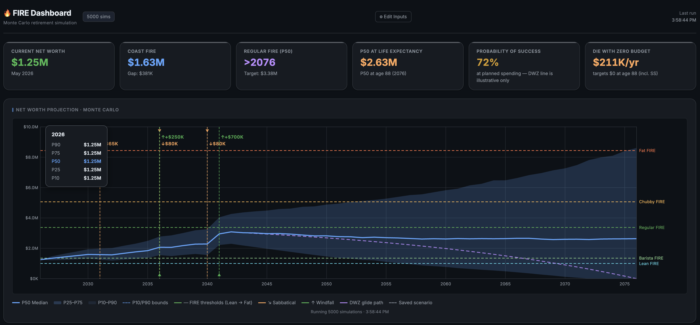

# FIRE Dashboard

A Monte Carlo retirement-planning tool: given your savings, spending, and risk profile, it models thousands of possible market paths and answers three questions — when can you retire, how much do you actually need, and how confident should you be in that number.

## What it models

- **Monte Carlo simulation** — thousands of simulated annual return paths (Normal-distributed, mean/volatility drawn from a selected risk profile), reported as P10–P90 percentile bands rather than a single point estimate.
- **Six FIRE thresholds** — Coast, Lean, Barista, Regular, Chubby, and Fat FIRE, each derived from a safe-withdrawal-rate multiple of expenses. Coast FIRE additionally discounts the target back to today's dollars at the real rate of return, answering "how much do I need *right now* to coast to retirement with no further contributions."
- **Die With Zero** — an annuity amortization (the same math behind mortgage/loan payment schedules) that computes the exact annual withdrawal which depletes the portfolio to $0 by life expectancy, rather than the more conservative "never touch principal" framing.
- **Probability of success** — the share of simulated paths that never deplete during retirement. A path that runs dry and is later revived by a windfall still counts as a failure — the retiree was broke in between.
- **International scenario modeling** — 20 countries, each offering one-click adjustments for cost of living, income-tax gross-up, inflation, and life expectancy (applied only when you accept them), with pension claim age and capital-gains rates shown for reference. A relocation or retire-abroad scenario adjusts the model rather than requiring a second spreadsheet.
- **Life events** — sabbaticals, career breaks, raises, one-time windfalls/inheritances, and go-go/slow-go/no-go retirement spending phases, all composable on the same timeline.
- **Common random numbers** — when comparing "what if I saved 25% more" against a baseline, both scenarios share the same underlying sequence of simulated market returns. Without this, the reported improvement from a lever is dominated by fresh Monte Carlo sampling noise rather than the lever itself.

## Try it

Clone the repo and open `index.html` directly in a browser — no build step, no server, no dependencies beyond a Google Fonts import. Everything runs client-side; your inputs are saved to `localStorage` and never leave the browser.

## Notes

- Single-file vanilla HTML/CSS/JS by design — no framework, no bundler. The chart is hand-drawn on `<canvas>`, not a charting library.
- This is a personal modeling tool, not financial advice. Assumptions (Monte Carlo returns, tax rates, cost-of-living indices) are illustrative and should be sanity-checked against your own numbers.
